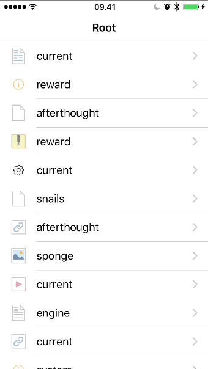

# ios-dragable-table-cells

Support for drag-n-drop of UITableViewCells in a navigation hierarchy of view controllers.
You drag cells by tapping and holding them. You go deeper into the hierarchy by hovering the
cell above another cell and you step out by hovering above the left side of the navigation bar.

View controllers are stacked as cards on top of the starting view controller and there will
also be some of the starting view controller visible. Hovering above starting view controller
steps back in the view hierarchy on view controller at a time. 

You just include the two source files at the root of this repository in your project. 
View controllers need to implement a protocol that maps between cells and the view controllers
these cells would bring you and performs the action when drag has completed. 

  
  
When cells are created or shown you need to register for dragging. It is safe to register a cell multiple 
times.

````
#import "AB_DragableTable.h"
- (UITableViewCell *)tableView:(UITableView *)tableView cellForRowAtIndexPath:(NSIndexPath *)indexPath {
	UITableViewCell* cell = [tableView dequeueReusableCellWithIdentifier:identifier forIndexPath:indexPath];
    [cell registerForDragging];
    return cell;
}

````

This is used in [Working Copy](https://WorkingCopyApp.com/) to move around files in Git repositories.
You can reach me as [@palmin](https://twitter.com/palmin) on Twitter.
